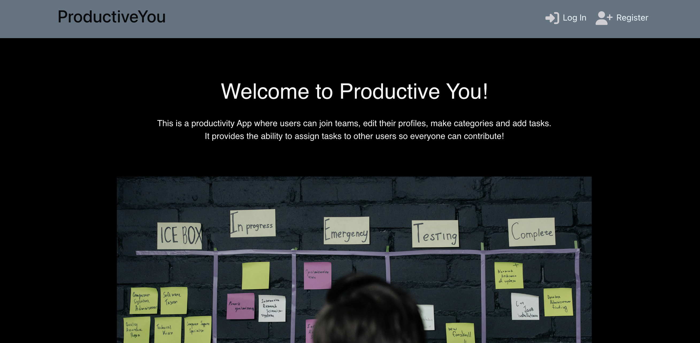
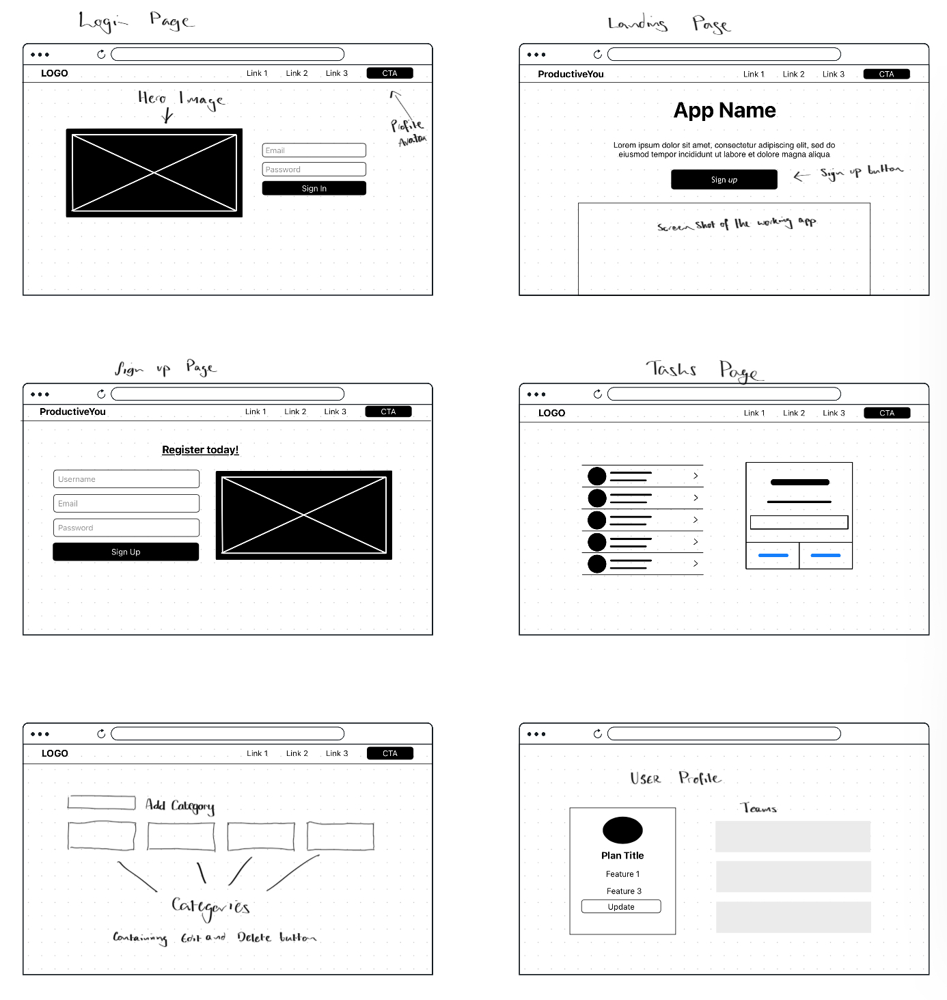

# ProductiveYou Front-End
**Code Institute PP05 Front-End**

## Project Overview

This is ProductiveYou, my take on a productivity app for teams and workplaces. The aim is to give users the ability to sign up, assign teams and collaborate on task management. Users can choose a team to complete each task and set its priority, as well as assigning each task to a category, helping keep tasks organized.

This project works hand in hand with another project I’ve made [ProductiveYou API](https://github.com/LeighAllenDev/ProductiveYouAPI) which works as the back-end for this, creating a working database and allowing users to login and register, as well as opening up full crud functionality so they can create, read, update and edit tasks and categories.

## Table of Contents
1. [Project Overview](#project-overview)
2. [Design Process](#design-process)
    * [Features](#features)
    * [Future Enhancements](#future-enhancements)
3. [Security Practices](#security-practices)
4. [Component Usage](#component-usage)
5. [Deployment Process](#deployment-process)
6. [Front-end Code Standards](#front-end-code-standards)
7. [Testing and Version Control](#testing-and-version-control)
    * [Manual Testing](#manual-testing)
    * [Additional Testing](#additional-testing)
    * [Version Control](#version-control)
8. [Agile Project Management](#agile-project-management)
    * [User Stories](#user-stories)
    * [Agile Practices](#agile-practices)
9. [Front-End Libraries](#front-end-libraries)
10. [Credits](#credits)

## Design Process
During the design process I drew up some wireframes of how I expected pages to look, this game me a base for the front end UI. Although the overall project evolved over time.

The site has a minimalistic design with a black background, White cards and the text alternates between white and black depending on the background. Cards are styled as bootstrap components and the buttons are also bootstraps default styling.
### Features

**Dynamic nav bar** - The project utilizes a dynamic navigation bar that updates once the user has logged in, see images below. This prevents a user being able to add tasks, categories or manipulate the site in any way without being registered.

When the user isnt logged in the navbar only displays links to a **Sign in** and **Register** page as seen below.

When a user is logged in, the navbar displays links to the pages Tasks, Categories, Teams, the users profile, and the log out button. The users profile image and username appear in the navbar.

**Responsive Navbar** - The site has a responsive Nav bar with a toggle to hide links on smaller devices: 

**Responsive User Interface** - This project has a responsive UI that adapts to different screen sizes depending on what type of device the user is viewing the app on.

**Profile Page** - The profile page allows the user to update their name, give a bio and upload a profile photo, it also allows users to directly see what teams they are a part of.

**Real-time updates** - As you create or edit teams these updates are seen below the Team form and also instantly update on the users profile.

**Alerts** - When a user adds or edits anything on the site they are alerted of the relevent changes, they are also asked to confirm if they are sure they want to delete something.

## Future Enhancements
This project forms a base of my idea but potential future enhancements would be:
* Adding the ability for teams to view the tasks in the teams page and then assigning each team to specific users
* Viewing task files within the Task details section of the app
* Notifications and messaging between users
The site is functional without these enhancements but As I get more experienced as a developer hopefully I would build the required knowlege base to be able to implement these enhancements.

## Security Practices

This project is linked to my ProductiveYou API that I built with Django using the REST framework and Allauth which is a python library that handles registration and the ability to login and out. When a user registers an account with this project the Django backend automatically creates a user profile. 

The site is designed in a way that only authenticated users can create, edit or delete anything on the site, this also prevents users from seeing tasks unless they are logged in.

## Component Usage

The app is broken down to a number of components to improve the speed and functionality. These components are:

- NavBar - Conditional NavBar dependent on the users login status
- SignIn - forms the sign in page for the app
- SignUp - This component allows users to register an account
- TaskPage - This is the base of the Tasks section
    - TaskList - This provides a list of the users current tasks
    - TaskForm - This provides the function to add tasks to the database
    -TaskDetail - Allows users to view complete tasks to edit
- CategoriesPage - This shows a list of the categories in the database that tasks can be assigned to
    - categoryEdit - Edit or delete existing categories
- ProfilePage - Loads the profile page, also shows what teams they are members of
    - EditProfile -Gives users the option of updating their name, bio and a profile image
- Teams - Shows a list of existing teams, has a link to create new teams
		- TeamsEdit - allows the user to edit or delete teams
		- TeamsJoin - This component handles the functionality of allowing users to join teams
- HomePage - This is the home page of the app

## Deployment Process
To deploy this project to heroku I use following process, here are the steps:
- Log in to Heroku
- Click the **New** button at the top right of the page
- Select **Create new app** in the dropdown menu
- Choose a unique name for the project: **react-productive-you**
- Select the region for the app then click **Create App**
- On the *Deployment Method* section, select **GitHub** and connect to your **GitHub account**
- Search through the repositories and find the one that matches this project - **React-ProductiveYou**
- at the bottom of the page, click on the **Deploy** button.
## Front-end Code Standards
The JSX Code practices for a react project are as follows:
* Keep code readable, break complex components down to smaller reusable components to enhance maintainability and readability
* Use of fragments - Use fragments to group multiple elements together to avoid adding extra nodes to the dom
* Self closing tags - Using self closing tags without children helps to keep the code clean and consise
* Consistent Styling - Stick to a consistent style such as camelCase and aloways closeing tags

Additional React Best Practices Include:
* Ensure to keep folders clearly structured
* Structuring order of imports
* Adhere to React naming conventions
* Use an ES linter
* Use snippet libraries

## Testing and Version Control

### Manual Testing

During testing of this project I run **npm start** which brings up the development server and a live preview of the site. I go through every page as I complete it and if there are error they are either notified in the terminal or through an error message on the preview. 

For pages that send or receive data through the API I use the chrome developer tools to see the terminal which will give more detailed information if there is an issue with a get or push request. then commit my changes and try to fix the error, with each step committing so that, if needed, I can go back through previous versions.

### Additional Testing
On getting a resub for this project, I performed additional tests. I had successfully deployed this project to **Heroku**, however I hadn't properly checked to make sure it worked correctly. As it turned out, users were unable to register an account or log in, this was due to an error with the API where I hadn't correctly set up the cors headers. After fixing that through the API repository, users are now able to login, create accounts and update all parts of this site as intended. 

### Version Control

During the development of this React project I have continually used GitHub and Git for version control. With every project, there are huge benefits to using version control such as Git, examples of these are as follows:
- Collaboration - Git allows multiple developers to work on the same project simultaneously without the risk of overwriting each overs changed. This allows each developer to work on separate branches and it can be merged together when they have finished.
- Keeping track of history - When using Git there are a number of commit message conventions that I try to follow as closely as possible. These help keep changes clear and easy for other developers to see.
It is also important when using Git to make sure you follow the best practices which are as follows:
* To make incremental, small changes, commiting frequently with small changes avoids large commits that could have many issues in them
* Use of descriptive commit messages, writing clear commit message help explain the purpose of each change
* Identifying a branching strategy for a project, using a framework can help managing and creating branches effectively.
* Dont break builds, you should ensure that the changes you're about to commit wont break the existing codebase and run tests to verify everything is working before committing.
* Review code before committing, similarly to the above, if colaborating work with the team to make sure there are no errors in the code about to be committed
* Ensuring tracable commits meaning that each commit should be able to identify a specific issue or feature.

## Agile Project Management
Working completely alone it is somewhat difficult to work in an agile environment as it is just me, but I have tried to abide by agile methods as much as possible, mainly with following user stories.
### User Stories
For this project I’ve created a list of user stories and posted them as issues in the project repository that I have to work towards and fix. these user stories are as follows:

1. As a **Site User** I can **register an account** so that I can **keep track of ongoing tasks**
- Users are able to register an account
- users can log in and out of the app
- User login information is kept safe and secure
2. As a **Site User** I can **see my login status** so that I can **tell if I’m still logged in**
- Users can log in with their registered account
- Users can see their login status in the navigation bar of the app
3. As a **Site User** I can **set a due date for a task** so that I can **see if a task is overdue**
- Users are able to assign due dates to tasks
- Users can view the task due dates from the main screen
- Users are notified if their tasks are overdue
4. As a **Site User** I can **Add Teams** So that I can **Assign tasks to other users**
- Users are able to create and edit teams
- Users are able to assign specific tasks to teams
5. As a **Site User** I can **easily navigate the app** so that I can **always keep track of what page I’m on**
- A navbar is clearly positioned on the top of the app
- The active page is always highlighted in the navbar
6. As a **Site User** I can **Upload files** so that I can **provide more detail for tasks**
- Users can upload files to tasks
- users can view uploaded files on the on-going tasks page.
7. As a **Site User** I can **view existing tasks** so that I can **mark them as completed**
- Tasks have a completed button
- Tasks are visible and editable after they are created
- Users can view, edit and delete tasks.

### Agile Practices
Provided below are a list of Agile best practices to follow in software development:

**Iterative Development** - Breaking a project down into small, manageable chunks, delivering a complete increment at the end of each iteration

**Continuous Feedback** - Regularly seeking feedback and ensuring the product meets the needs of the users

**Daily Stand-ups** - holding short daily meetings to discuss the previous days work and current days plan

**Collaborative work** - A collaborative with environment allows the team to work closely together

**User Stories** - Using user stories helps to define the features from a users perspective, these can be prioritized based on users needs and business value

**Backlog grooming** - Regularly reviewing and prioritizing the product backlog ensures the team is working on the most valuable tasks. User stories can be broken down as needed.

**Retrospectives** - Conducting retrospectives at the end of each iteration allows you to reflect on what went well, what didnt, and what can be improved 

**Intergration and Deployment** - code changes should be integrated frequently and tests run to detect issues early. Code should be deployed to production early to ensure its working in a real environment

**Cross-Functional Teams** - Teams should be cross fucntional making sure they have all the neccessary skills to deliver the product

## Front-End Libraries

This project is built using **React.js** a JavaScript library made for front end UI/UX development. On top of React.js I’m also using the following libraries:

- Bootstrap - a front end library for styling
- React-Bootstrap - a front end library
- React Router DOM
- CSS is used for styling
- HTML is used in line with the jsx components

## Credits
* For this project, like all previous projects in this course, my Code Institute mentor has been a great help, as well as the student tutors and the learning through course material.
* The Design of the NavBar and signin/signup pages was mostly taken from the course material Moments.
Chat GPT for a list of Agile practices to follow.
* Stock Images borrowed from Pexels.com